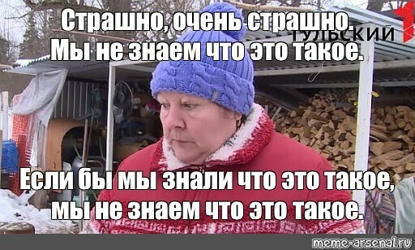
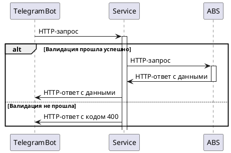

Telegram-bot
========================
Учебный проект в рамках GPF

## AS IS:

## TO BE
Предполагается, взаимодействие будет происходить таким образом:

### Для запуска проекта:
Если бы проект был готов, тут было бы описание как его запустить, но он не готов.

### Ссылка на Swagger:
Будет проект, будет ссылка на поодробную, хорошо описанную документацию.
