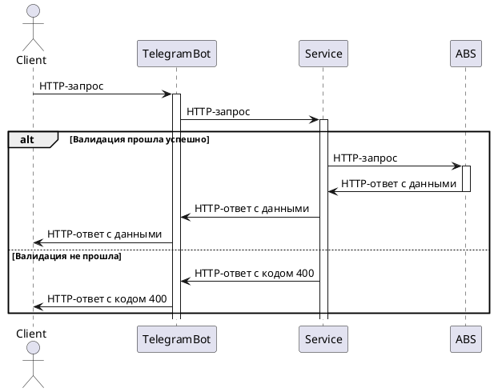

Telegram-bot
========================
Учебный проект в рамках GPF. Telegram-бот выступает как клиентское приложение, инициирует запросы пользователей.
Данные получаются из сервиса выступающего в качестве АВС.

## AS IS:


## TO BE

Предполагается, взаимодействие будет происходить таким образом:



### Для локального запуска проекта:

1. Cкачать содержимое Github репозитория командой:
```
   git clone https://github.com/gpb-it-factory/davydova-telegram-bot.git
```

2. Затем перейти в скачанный каталог "davydova-telegram-bot":
```
cd davydova-telegram-bot
```

3. Скомпилировать jar:
```
./gradlew build  
```

4. Cобрать образ:
```
docker build . -t davydova_telegram_bot
```

5. Запустить контейнер (<yourTokne> - ваш токен полученный от FatherBot):
```
docker container run -p 330:330 -e TOKEN_ENV=<yourTokne> --name gbf_bot -d davydova_telegram_bot
```

6. Заниматься прокрастинацией играя в пинг понг с ботом

### Ссылка на Swagger:

Будет проект, будет ссылка на поодробную, хорошо описанную документацию.
